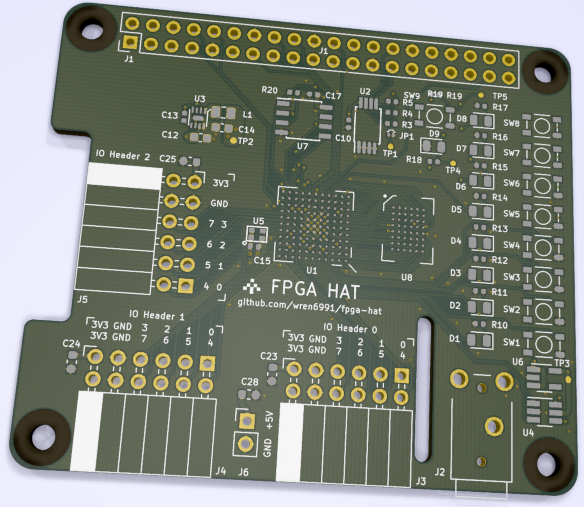

FPGA HAT
=========

As an experiment, I am designing a PCB using only my Pi 4 4GB. Any other machine is off-limits. This includes

- Schematic entry
- Layout
- Datasheets and reference material
- Background Twitter browsing
- The below rendering:

The board is a HAT (Raspberry Pi addon board) with a iCE40 HX8k FPGA. The Pi can program the FPGA, and communicate with it via a UART, or a fast bidirectional SDIO link. This project was spurred by the realisation that Pi 4 is a plausible FPGA development platform: faster processors, increased memory, and above all, the dramatic improvements in [Symbiotic EDA](https://www.symbioticeda.com/)'s open source design flows in the last few years.

[View schematic (PDF)](board/fpga_hat.pdf)

With the exception of the `datasheet/` directory (to which I do not lay claim), this repository is distributed under the [Apache-2.0 License](License).

Features
--------

- iCE40 HX8k
- 4 Mbit SRAM, 16 bit wide, 10 ns access
- 4 Mbit flash for FPGA image and user data; dual I/O support
- 3 PMOD-compatible expansion headers
    - 8 3.3V IOs each, plus power and ground
    - 2 headers on one side, 1 on another; the two on one side have standard 0.9" spacing, allowing use of dual-PMOD boards
- Communication with host Pi:
    - UART
    - SPI for flash programming
    - SDIO for fast communications
    - FPGA reset, and configuration status (CDONE)
- 8 user pushbuttons and LEDs
- Reset button and configuration status LED
- Audio output via 3.5 mm jack (same audio circuit as Pi)

Tolerances
----------

Of the 121 balls on the FPGA's BGA package, I am using 120; the sole unconnected ball is VPP_FAST, which is used only for NVCM programming. This will make the layout exceptionally tight, which is part of the experiment! For a fighting chance, I am using JLCPCB to manufacture the prototype boards, rather than my usual iTead. Their tighter manufacturing tolerances should permit two traces between 0.3 mm pads on a 0.8 mm-pitch BGA, which allows the first 3 ranks of balls to be routed out on layer 1.

The capability requirements for this board are:

- Via drill 0.2 mm
- Via diameter 0.45 mm
- Copper min width 0.09 mm
- Copper-copper clearance 0.09 mm
- Solder mask expansion 0.05 mm
